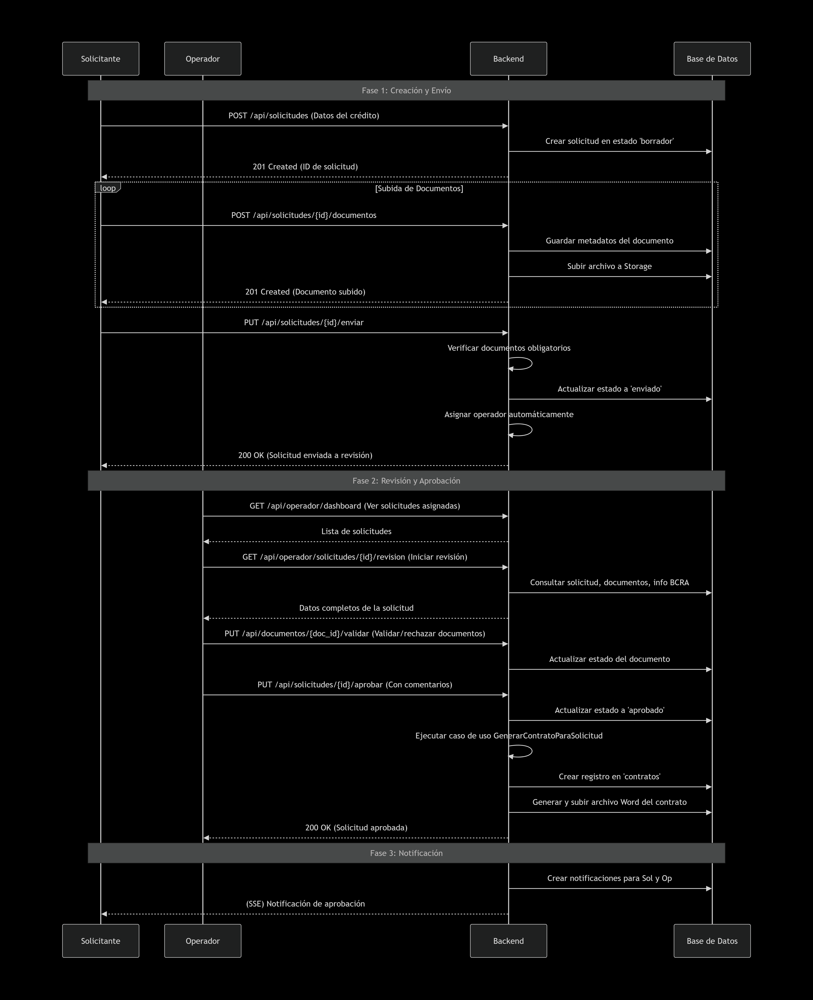
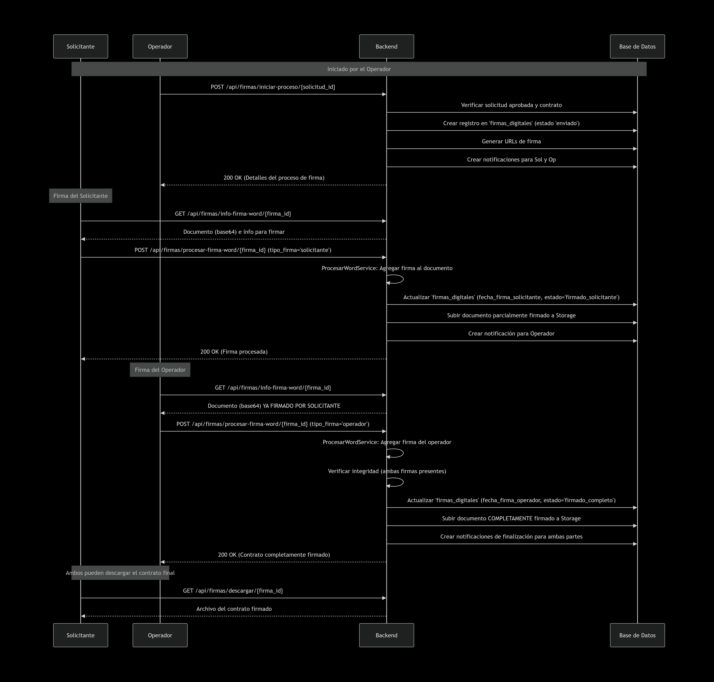
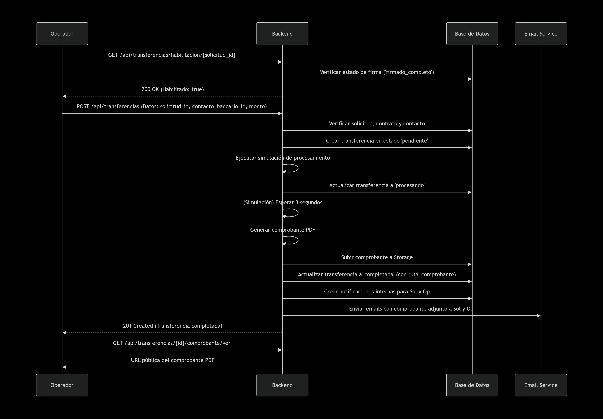

---

### ** Documentación de Casos de Uso / Flujos de Negocio**

**Nombre del archivo:** `FLUJOS_DE_NEGOCIO.md`

```markdown
# Documentación de Flujos de Negocio - Nexia

Este documento describe los principales flujos de usuario y procesos de negocio del sistema, incluyendo roles, permisos y escenarios críticos.

---

## Flujo de Usuario: Registro y Activación de Cuenta

Este flujo describe el proceso desde que un nuevo usuario se registra hasta que puede acceder al sistema.


## Flujo de Usuario: Creación y Aprobación de una Solicitud de Crédito
Este es el flujo central del negocio, que abarca desde la creación de una solicitud por parte del solicitante hasta su aprobación y la generación del contrato.


## Flujo de Usuario: Firma Digital del Contrato
Una vez aprobada la solicitud, se inicia el proceso de firma digital.



## Flujo de Usuario: Transferencia Bancaria
Una vez el contrato está firmado, el operador puede proceder con la transferencia.


# Roles y Permisos

El sistema define dos roles principales de usuario con diferentes permisos de acceso.

---

# Rol: solicitante

**Descripción:**  
Usuario final que solicita un crédito.

## Acciones Permitidas

- Registrarse y gestionar su propio perfil.
- Crear, editar y eliminar solicitudes en estado borrador.
- Subir, actualizar y eliminar sus propios documentos.
- Enviar solicitudes a revisión.
- Ver el detalle y estado de sus solicitudes.
- Firmar digitalmente los contratos de sus solicitudes aprobadas.
- Ver el historial de sus transferencias y descargar comprobantes.
- Comunicarse con el operador a través de comentarios.
- Utilizar el chatbot.

---

# Rol: operador

**Descripción:**  
Usuario interno que gestiona y evalúa las solicitudes.

## Acciones Permitidas

- Gestionar su propio perfil.
- Ver un dashboard con todas las solicitudes asignadas (y filtros avanzados).
- Iniciar la revisión de una solicitud, viendo toda la documentación y la info de BCRA.
- Validar o rechazar documentos individualmente.
- Evaluar documentos (especialmente balances) con criterios específicos.
- Solicitar información adicional al solicitante.
- Aprobar o rechazar solicitudes.
- Iniciar el proceso de firma digital para solicitudes aprobadas.
- Firmar digitalmente los contratos.
- Crear y procesar transferencias bancarias para solicitudes con contrato firmado.
- Gestionar la lista maestra de contactos bancarios.
- Ver todas las solicitudes, documentos, contratos y transferencias del sistema.
- Gestionar plantillas de documentos.
- Acceder a estadísticas y reportes.

---

# Escenarios Críticos

---

## 1. Verificación KYC (Know Your Customer)

**Disparador:**  
Se inicia manualmente por un operador desde el detalle de una solicitud  
`POST /api/solicitudes/{id}/verificar-kyc`

### Proceso

1. El backend crea una sesión de verificación en el servicio Didit.
2. Se devuelve una URL al frontend, que redirige al solicitante a la interfaz de Didit.
3. El solicitante completa el proceso de verificación de identidad (foto de DNI, selfie, etc.) en la plataforma de Didit.
4. Didit envía un webhook:  
   `POST /api/webhooks/didit`
5. El backend procesa el webhook:
   - Actualiza el estado en la tabla `verificaciones_kyc`
   - Si es exitosa, marca el documento DNI asociado como validado

### Manejo de Errores

Si la verificación falla o es rechazada:
- Se registra el estado
- Se notifica al operador para que tome medidas

---

## 2- Rechazo de Firma o Error en el Proceso

**Disparador:**  
Un firmante (solicitante u operador) podría encontrar un error al intentar firmar, o el proceso de firma podría fallar.

### Proceso

1. El backend verifica el estado actual de la firma (`firmas_digitales.estado`).
2. Si el proceso falla (ej. error al descargar/subir documento):
   - Se registra el error en los logs
   - Se crea una notificación para el operador  
     `NotificacionService.notificarErrorFirmaDigital`
3. El operador puede:
   - Investigar el problema
   - Utilizar endpoints de reparación si es necesario:  
     `/api/firmas/reparar-relacion/{firma_id}`
   - Forzar el reinicio del proceso:  
     `/api/firmas/reiniciar-proceso/{solicitud_id}`

### Manejo de Errores

El sistema permite intervención manual del operador para resolver inconsistencias (ej. relación firma-contrato rota).

---

## 3. Reactivación de Cuenta

**Disparador:**  
Un usuario intenta iniciar sesión en una cuenta previamente desactivada.

### Proceso

1. El usuario hace clic en "¿Olvidaste tu cuenta?" en el frontend.
2. El frontend envía:  
   `POST /api/usuarios/solicitar-reactivacion` con el email.
3. El backend:
   - Busca un usuario con ese email y `cuenta_activa = false`.
4. Si existe:
   - Se genera un token de reactivación (expira en 1 hora).
   - Se envía un email con un enlace.
5. El usuario hace clic en el enlace:  
   `GET /api/reactivacion/procesar?token=...&email=...`
6. El backend:
   - Valida el token
   - Busca la cuenta inactiva
   - La reactiva (`cuenta_activa = true`)
7. El usuario es redirigido al frontend y puede iniciar sesión normalmente.

### Manejo de Errores

- Se valida la expiración del token.
- Se valida que el email coincida.
- Si el token es inválido o expiró, se muestra un error al usuario.