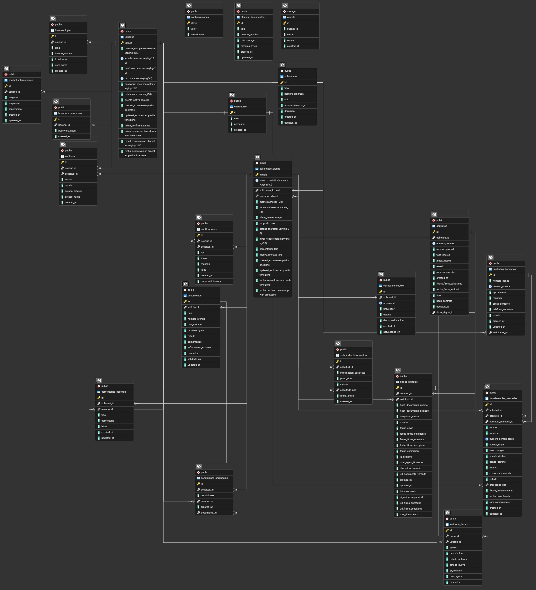

# Modelo de Datos - Nexia (Onboarding de Créditos)

## Visión General
Este documento describe el esquema de base de datos para la plataforma de onboarding de créditos "Nexia". El sistema está diseñado para gestionar el ciclo de vida completo de una solicitud de crédito, desde el registro del usuario (PYME) hasta el desembolso del préstamo.
## Arquitectura Modular de Base de Datos Basada en Migraciones
El proyecto implementa una arquitectura de base de datos modular, orientada por funcionalidades (feature-based) y basada en migraciones versionadas.

La estructura está organizada por módulos de negocio, donde cada dominio funcional del sistema (por ejemplo: usuarios, solicitantes, solicitudes de crédito, documentos, KYC, etc.) contiene todos los objetos de base de datos necesarios para su funcionamiento, tales como tablas, índices, triggers, políticas de seguridad y comentarios.

Este enfoque corresponde a una organización feature-based o vertical slice, ya que cada módulo encapsula de forma independiente todos los elementos relacionados con su responsabilidad dentro del sistema.

Adicionalmente, el proyecto utiliza un esquema de versionado basado en migraciones incrementales, lo que permite:

Controlar la evolución del esquema de base de datos.

Mantener trazabilidad de cambios en el tiempo.

Garantizar reproducibilidad en distintos entornos (desarrollo, pruebas, producción).

Integrarse fácilmente con herramientas de control de versiones como Git y procesos de CI/CD.

Este enfoque también se alinea con el paradigma de Database as Code (DaC), donde la definición completa de la base de datos se gestiona como código versionado, promoviendo buenas prácticas de ingeniería de software, mantenibilidad y escalabilidad.

## Módulos Principales
El modelo de datos se organiza en los siguientes módulos funcionales:

1.  **Gestión de Usuarios (`usuarios`, `solicitantes`, `operadores`):** Maneja la autenticación, roles (solicitante/operador) y perfiles específicos para PYMES y personal de la entidad financiera.
2.  **Solicitudes de Crédito (`solicitudes_credito`):** El núcleo del sistema, donde se registra cada petición de préstamo y su estado en el workflow.
3.  **KYC/AML (`documentos`, `verificaciones_kyc`):** Gestiona la carga y validación de los documentos obligatorios y la verificación de identidad de los solicitantes.
4.  **Contratos y Firmas (`contratos`, `firmas_digitales`, `auditoria_firmas`):** Tras la aprobación, se genera un contrato que debe ser firmado digitalmente por ambas partes, con un alto nivel de trazabilidad.
5.  **Desembolsos (`contactos_bancarios`, `transferencias_bancarias`):** Gestiona la información bancaria del solicitante y el registro de las transferencias realizadas.
6.  **Comunicación y Soporte (`notificaciones`, `comentarios_solicitud`, `chatbot_interacciones`):** Alberga la interacción entre el sistema, el operador y el solicitante.
7.  **Auditoría y Seguridad (`auditoria`, `intentos_login`, `historial_contrasenas`):** Registra eventos críticos para la seguridad y el cumplimiento normativo.

## Principales Tablas y Relaciones Clave

*   `usuarios` es la tabla base. `solicitantes` y `operadores` tienen una relación 1:1 con ella, heredando sus datos de autenticación y contacto.
*   `solicitudes_credito` es la tabla central. Se relaciona con `solicitantes` (quién pide) y `operadores` (quién revisa).
*   Una `solicitud_credito` puede tener múltiples `documentos`, una `verificaciones_kyc`, y eventualmente, un único `contrato`.
*   Un `contrato` está asociado a una única `firma_digital`.
*   Una `transferencia_bancaria` se asocia a un `contrato` y a un `contacto_bancario` del `solicitante`.

## Convenciones Generales

*   **Nombres de Tablas:** `snake_case` en plural (ej: `solicitudes_credito`, `usuarios`).
*   **Clave Primaria:** Se utiliza `UUID` como clave primaria por defecto, generado con `uuid_generate_v4()`.
*   **Claves Foráneas:** Siguen el patrón `nombre_tabla_referenciada_singular_id` (ej: `solicitante_id`, `operador_id`).
*   **Auditoría de Fechas:** Todas las tablas principales incluyen `created_at` y `updated_at` (gestionado por triggers).
*   **Borrado Suave (Soft Delete):** Se implementa mediante la columna `cuenta_activa` en la tabla `usuarios`. Para el resto de tablas, se prefiere el borrado en cascada o la desactivación lógica a través de estados (ej: `estado` en `solicitudes_credito`).

## Diagrama ER
El diagrama entidad-relación fue generado automáticamente con el pgAdmin o `dbdiagram.io` para una comprensión visual completa.
